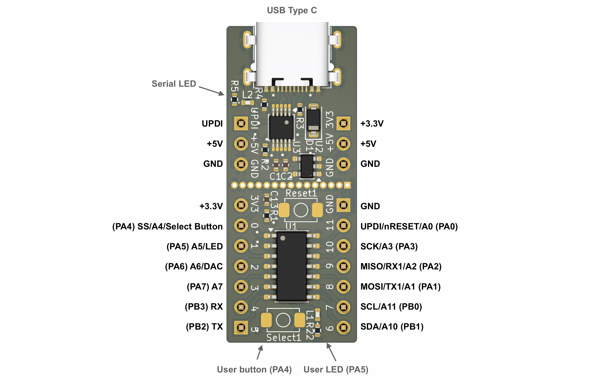
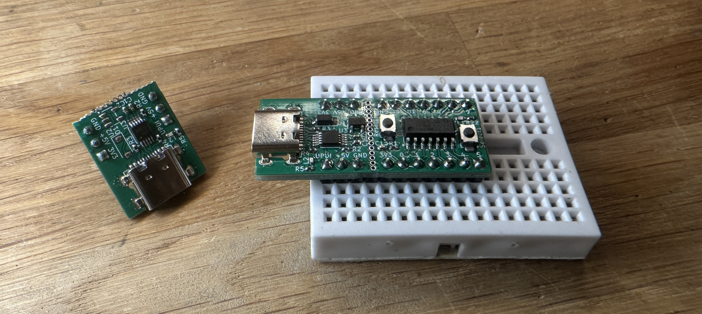
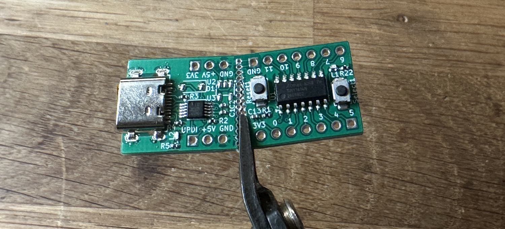

# ATTinyX14
Tiny breadboard compatible development board that can contain either an ATTiny414, ATTiny814 or ATTiny1614 - depending on your need for Flash memory.

## Pinout

## Features
This nifty little microcontroller paired with the CH340 serial chip, makes for a very compact development board. Due to it's tiny size, you have 3 rows on each side of the breadboard to connect jumper wires to. When used with Spence Konde's brilliant [ATTinyCore](https://github.com/SpenceKonde/ATTinyCore), this is very smooth to use for prototyping.

The board has a builtin LED on (PA5) and a button (PA4) for testing. The Serial chip has a LED on the TX line, so you can visually inspect when programming is done and finished.

Some things to note:

### 2-in-one
The UPDI programmer can be cut away, so you can use the MCU and programmer separately. In that case, the MCU must be powered separately, since the 3.3V regulator sits on the UPDI Programmer.

### Drawbacks
One drawback is that the setup does not allow for direct Serial debugging. You have to connect a separate Serial Converter/Adapter ([like this one](https://www.taydaelectronics.com/cp2102-serial-converter-usb-2-0-to-ttl-uart-ftdi.html) or anything similar) to use Arduino's Serial.
